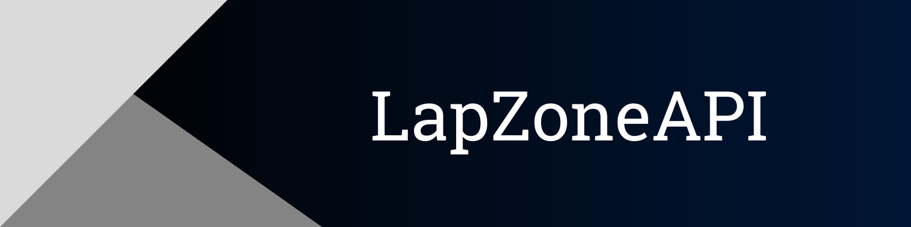

_API (Django + DRF) for my Internet shop [LapZone](https://lapzone.tech)_

## Purpose

My Internet shop [LapZone](https://lapzone.tech) ([GitHub](https://github.com/Gubchik123/LapZone)) was written using templates, but in our time there are not a lot of projects that use templates. That's why here is API of the "LapZone"

## Project modules

<a href='https://pypi.org/project/Django'></a> <a href='https://pypi.org/project/djangorestframework'></a> <a href='https://pypi.org/project/django-ckeditor'></a> <a href='https://pypi.org/project/django-cors-headers'></a> <a href='https://pypi.org/project/django-filter'></a> <a href='https://pypi.org/project/django-rest-framework-social-oauth2'></a> <a href='https://pypi.org/project/djoser'></a> <a href='https://pypi.org/project/drf-social-oauth2'></a> <a href='https://pypi.org/project/drf-yasg'></a> <a href='https://pypi.org/project/Pillow'></a> <a href='https://pypi.org/project/psycopg2'></a> <a href='https://pypi.org/project/python-dotenv'></a> <a href='https://pypi.org/project/pytz'></a> 

> Look at the requirements.txt

## Environment Variables

To run this project, you will need to add the environment variables

> Look at the file_env_example.txt

## Getting Started

To get started with the project, follow these steps:

1. Clone the repository:
    ```
    git clone https://github.com/Gubchik123/LapZoneAPI.git
    ```

2. Go to the project directory:

    ```
    cd LapZoneAPI
    ```

3. Install the required dependencies:
    ```
    pip install -r requirements.txt
    ```

4. Apply migrations:
    ```
    python manage.py migrate
    ```

5. Run the development server:
    ```
    python manage.py runserver
    ```

    > **Note:** Don't forget about environment variables